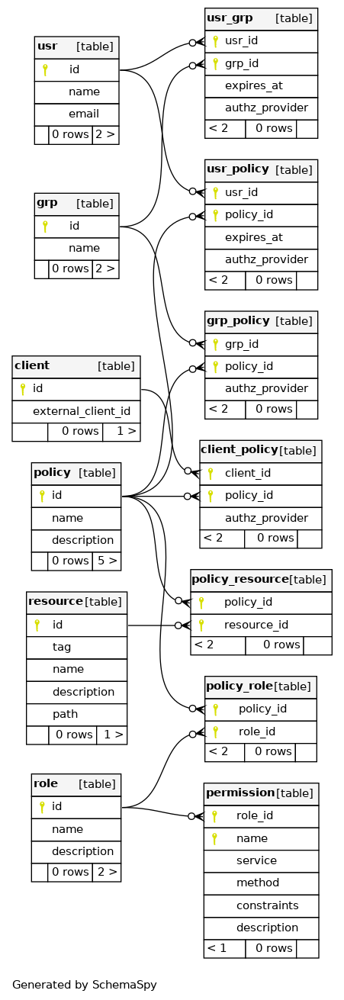
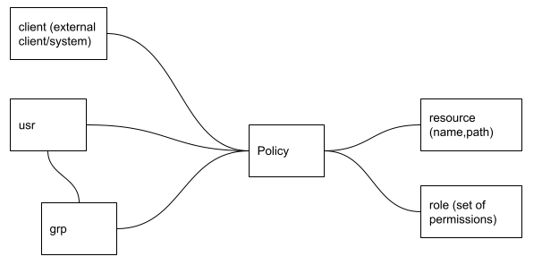

## Arborist DB diagram

Entity Relationship Diagram for Arborist DB:

This diagram can also be represented in a simpler form:

where the _policy_ table is clearly used to give _client_ systems, _users_ and/or _groups of users_ a specific set
of _permissions_ on a _resource_.
